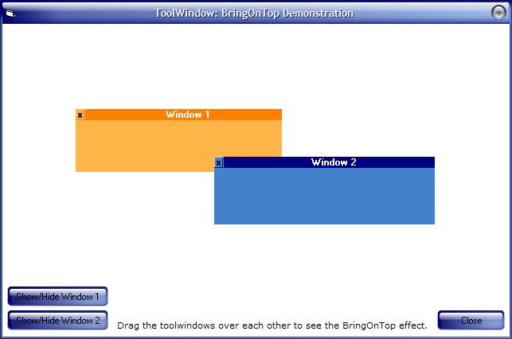



## \[FA\] Draggable ToolWindow

### Description

This is a draggable toolwindow inside another window. Normally windows can only be inside an MDI form, but this is a great control which looks and acts like a real window. Completely customizable!!! If you plan to place many toolwindows inside a form, try duplicating the source files and adding each toolwindow as a separate toolwindow so you can customize them according to your needs. [ See another demonstration of this control in my other project: City Builder (txtCodeId=57486&lngWId=1)]
 
### More Info
 

             |
---                |---
**Submitted On**   |2004-11-30 21:47:50
**By**             |[Faraz Azhar](https://github.com/Planet-Source-Code/PSCIndex/blob/master/ByAuthor/faraz-azhar.md)
**Level**          |Advanced
**User Rating**    |3.8 (19 globes from 5 users)
**Compatibility**  |VB 6\.0
**Category**       |[Custom Controls/ Forms/  Menus](https://github.com/Planet-Source-Code/PSCIndex/blob/master/ByCategory/custom-controls-forms-menus__1-4.md)
**World**          |[Visual Basic](https://github.com/Planet-Source-Code/PSCIndex/blob/master/ByWorld/visual-basic.md)
**Archive File**   |[\[FA\]\_Dragg1824091212004\.zip](https://github.com/Planet-Source-Code/faraz-azhar-fa-draggable-toolwindow__1-57502/archive/master.zip)

